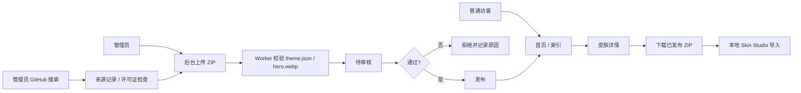

# Codex / ChatGPT Desktop 皮肤站实施方案

> **For agentic workers:** REQUIRED SUB-SKILL: Use superpowers:subagent-driven-development (recommended) or superpowers:executing-plans to implement this plan task-by-task. Steps use checkbox (`- [ ]`) syntax for tracking.

**Goal:** 建设一个面向 Codex 与 ChatGPT Desktop 用户的皮肤压缩包下载站，提供可检索的图文皮肤卡片、Pinterest 式瀑布流展示、管理员人工上传与审核发布，并与 `codex-skin-studio` 的主题文件契约打通。

**Architecture:** 使用 Payload CMS 作为内容与审核后台，运行在 Cloudflare Workers；使用 Cloudflare D1 保存结构化元数据，R2 保存皮肤压缩包和预览素材。普通访客无需注册或登录，只能读取已发布皮肤；管理员通过 Payload Auth + Cloudflare Access 进入后台。网站与本机 `codex-skin-studio` 通过统一的 `theme.json` / `hero.webp` 压缩包契约衔接，第一阶段提供稳定下载与手动导入，第二阶段再增加本机一键导入。

**Tech Stack:** Payload CMS、Next.js（以 Payload 官方 Cloudflare 模板为基础）、Cloudflare Workers、D1、R2、Wrangler、TypeScript、React、CSS Modules 或 Tailwind、`@payloadcms/db-d1-sqlite`、`@payloadcms/storage-r2`、Playwright、Node Test Runner。

## Global Constraints

- 普通访客不需要注册和登录。
- 网站不开放普通用户直接上传，也不提供 Submit 页面；用户在 `codex-skin-studio` Skill 中明确同意后，由 Skill 通过短时 HMAC 签名 API 上传，服务端验证后进入人工审核队列。
- 不建设皮肤编辑器；网站定位是皮肤展示、检索、审核和 ZIP 压缩包下载站。
- 不使用紫色、紫色渐变或黑色作为网站主背景；主视觉采用白色/乳白色科技 UI。
- 允许皮肤内容本身使用二次元、角色、像素、Cyber、Anime / 2D 等元素。
- 网站默认面向 Codex Desktop 与 ChatGPT Desktop；皮肤卡片必须展示兼容目标。
- 不允许草稿、待审核或被拒绝的皮肤出现在公开 API、公开列表或公开下载接口。
- 不把远程 URL、任意文件路径或任意命令直接传给本机 `codex-skin-studio` 控制接口。
- 不修改 ChatGPT Desktop / Codex 的 `app.asar`、代码签名、官方 JavaScript 或安装目录。
- 所有压缩包必须进行 ZIP 路径、大小、数量、MIME、主题清单和资源完整性校验。
- Payload / Cloudflare 依赖版本以官方 Cloudflare 模板生成结果为基线；MVP 期间不跨 Payload major 版本升级。
- 每个实施任务必须有独立的测试或验收证据。

---

## 1. 产品结论

### 1.1 产品定位

产品不是泛用的设计素材站，也不是皮肤编辑器，而是：

> 面向 Codex 与 ChatGPT Desktop 用户的“桌面皮肤商店 / QQ 皮肤库”，用可视化皮肤卡片展示主题风格，并提供经过人工审核的 ZIP 主题包下载。

用户进入网站后需要在很短时间内完成三件事：

1. 找到适合自己工作场景的皮肤。
2. 判断它是否适配 Codex、ChatGPT Desktop 或双端。
3. 下载 ZIP，并按 Skin Studio 契约导入或应用。

### 1.2 现成开源项目决策

没有选择 Modrinth 等大型内容平台作为直接基础。它们可以参考“卡片、分类、下载、版本、标签”的产品模型，但与当前需求存在差异：

- 目标内容是 Codex / ChatGPT Desktop 皮肤，不是游戏 Mod。
- 不需要社区账号、评论、关注、复杂用户上传和社交关系。
- 需要人工审核和固定的 `codex-skin-studio` 主题文件契约。
- 需要 Cloudflare Workers + D1 + R2 的轻量部署形态。

因此采用 Payload CMS 自建是当前最可控的方案：后台内容模型、权限、草稿、版本、上传和审核可直接配置，前台只实现必要的皮肤展示和下载体验。

### 1.3 访客身份决策

| 角色 | 是否登录 | 能力 |
| --- | --- | --- |
| 普通访客 | 否 | 浏览、搜索、筛选、查看详情、下载已发布 ZIP |
| 管理员 | 是 | 进入 Payload Admin，上传、校验、编辑、审核、发布、下架 |
| 编辑人员 | 是 | 上传和编辑草稿；是否能发布由角色权限决定 |
| GitHub 研究人员 | 是 | 后台搜索 GitHub、记录来源、创建草稿，不直接发布 |

“不需要注册和登录”针对普通访客；后台必须保留管理员身份认证，否则审核和下载发布链路无法安全成立。后台登录由 Payload Auth 负责，后台域名额外由 Cloudflare Access 保护。

---

## 2. 已确认的视觉与交互方向

### 2.1 视觉关键词

- 科技皮肤商店
- QQ 皮肤库 / 桌面美化站
- 亮色产品 UI
- 版本号、状态、兼容性、下载量、ZIP 包信息
- 可容纳二次元、Anime / 2D、角色、像素、Cyber、赛博等主题
- 高密度但不拥挤的卡片流

### 2.2 色彩系统

网站基础不使用黑色或紫色：

| Token | 值 | 用途 |
| --- | --- | --- |
| `surface.page` | `#F2F7F7` | 乳白偏冷的页面底色 |
| `surface.card` | `#FFFFFF` | 卡片、面板、审核抽屉 |
| `text.primary` | `#173449` | 主文字、标题 |
| `text.muted` | `#60747D` | 说明、元数据 |
| `accent.blue` | `#2E70D1` | 主按钮、选中态、链接 |
| `accent.cyan` | `#08A7B6` | 成功态、特色标签、状态点 |
| `accent.green` | `#6AA544` | 已校验、已发布、通过 |
| `accent.orange` | `#EE5B3F` | 警示、重要动作、皮肤内容强调 |
| `accent.yellow` | `#EFB63F` | 版本、提示、次级强调 |

皮肤卡片的 `hero.webp` 可以使用深蓝、橙红或二次元高饱和色；限制只针对网站 UI 主色，不限制皮肤创作内容。

### 2.3 排版与组件风格

- 标题使用粗体无衬线或窄体无衬线，不再使用大段衬线杂志标题。
- 小标签、版本号、文件信息使用等宽字体。
- 皮肤卡片采用白色面板、蓝色边线、状态徽标和下载元数据。
- 首页与搜索页使用三列 Pinterest 式瀑布流；卡片图片高度可变化，使用 `break-inside: avoid`。
- 卡片必须展示：皮肤名、兼容目标、风格标签、版本或下载信息。
- 详情页必须展示：Hero 预览、目标平台、版本、ZIP 大小、主题 schema、下载按钮、Skin Studio 导入说明。
- 科技感来自信息结构、网格、状态、边框和动效，不使用紫色霓虹 AI SaaS 视觉。
- 二次元内容通过 `Anime / 2D` 分类、角色封面、像素风和高饱和主题素材进入，不把二次元元素烘焙到网站导航或后台 UI 中。

### 2.4 当前原型文件

当前可交互原型位于：

- [`prototype/index.html`](../../../prototype/index.html)
- [`prototype/styles.css`](../../../prototype/styles.css)
- [`prototype/app.js`](../../../prototype/app.js)

它只作为视觉和交互参考，不直接作为生产前端代码。原型已经验证以下页面：Gallery、Detail、Search、Upload、Review，并包含 Pinterest 瀑布流、Codex / ChatGPT 目标筛选和管理员审核抽屉。

---

## 3. 页面与信息架构

### 3.1 公共页面

| 路由 | 页面 | 核心内容 |
| --- | --- | --- |
| `/` | 皮肤首页 | 推荐皮肤、最新皮肤、兼容目标、瀑布流卡片 |
| `/skins` | 皮肤索引 | 搜索、目标平台、风格、颜色、排序、分页 |
| `/skins/[slug]` | 皮肤详情 | Hero、说明、版本、文件、兼容性、下载 |
| `/download/[slug]` | 下载入口 | 检查发布状态、记录下载、返回 ZIP |
| `/about` | 使用说明 | ZIP 格式、Skin Studio 导入方式、版权和举报 |
| `/robots.txt` | SEO | 允许公开皮肤页面，禁止后台和草稿路径 |
| `/sitemap.xml` | SEO | 只包含已发布皮肤详情页 |

### 3.2 后台页面

| 路由 | 页面 | 核心能力 |
| --- | --- | --- |
| `/admin` | Payload Admin | 管理员登录、集合、草稿和版本 |
| `/admin/collections/skins` | 皮肤管理 | 草稿、待审核、已发布、已下架 |
| `/admin/collections/theme-packages` | 压缩包管理 | ZIP、hash、大小、校验结果 |
| `/admin/github` | GitHub 发现 | 搜索公开仓库、许可证检查、创建草稿 |
| `/admin/review-queue` | 审核队列 | 预览、检查项、拒绝原因、发布 |

### 3.3 信息流



---

## 4. 技术架构

### 4.1 推荐部署形态

采用 Payload 官方 Cloudflare 模板作为起点，部署为一个 Cloudflare Worker 应用：

```text
Browser
  |
  | public.example.com
  v
Cloudflare DNS / CDN / WAF
  |
  v
Cloudflare Worker
  |-- Next.js public frontend
  |-- Payload REST / Local API
  |-- Payload Admin
  |-- custom download / search endpoints
  |
  |-- D1: metadata, users, reviews, versions
  |-- R2: theme zip, hero.webp, logo.webp, polaroid.webp
  |
  `-- Cloudflare Access on admin.example.com
```

不建议把 Payload 后台和生产数据库拆到另一家云服务。当前项目的核心价值是 Cloudflare 原生部署、低运维和 R2 文件分发；Payload 官方已有 Cloudflare + D1 + R2 模板可作为基线。[Payload Cloudflare 部署说明](https://payloadcms.com/posts/blog/deploy-payload-onto-cloudflare-in-a-single-click)

### 4.2 技术选择与理由

| 领域 | 选择 | 理由 |
| --- | --- | --- |
| CMS / Admin | Payload CMS | 内容模型、草稿、版本、Access Control、REST / Local API、上传后台开箱可用 |
| Web | Next.js + Payload 官方模板 | 公开页面和 CMS 在同一应用，避免额外 BFF；适合 SEO 和服务端取数 |
| 运行时 | Cloudflare Workers | 与 D1、R2、Access、Cache、Wrangler 绑定天然一致 |
| 数据库 | Cloudflare D1 + `@payloadcms/db-d1-sqlite` | SQLite 语义、Worker Binding、MVP 数据规模足够；官方 Payload D1 adapter 要求绑定名和 Worker 环境一致。[Payload D1 adapter](https://payloadcms.com/docs/database/sqlite) |
| 文件 | Cloudflare R2 + `@payloadcms/storage-r2` | 适合 ZIP 和 WebP 等非结构化文件；R2 无出网流量费且支持 Worker Binding。[Payload R2 adapter](https://payloadcms.com/docs/upload/storage-adapters) |
| Admin 安全 | Payload Auth + Cloudflare Access | 普通访客无登录；后台由身份白名单保护。Cloudflare Access 可保护公开 hostname 或 Worker。[Access 自托管应用](https://developers.cloudflare.com/cloudflare-one/access-controls/applications/http-apps/self-hosted-public-app/) |
| 搜索 | Payload 条件查询起步，D1 FTS5 作为扩展 | MVP 主题数量较少时使用字段过滤；超过约 5,000 个公开主题后再启用 FTS5 索引，避免过早增加同步复杂度 |
| 校验 | Worker-compatible TypeScript validator | 复用 `codex-skin-studio` 契约；ZIP 解析必须能在 Workers 中运行，禁止依赖 Node 文件系统 |
| 测试 | Node Test Runner + Playwright | 项目已有 Node 测试基础；Playwright 验证公共页面、筛选、下载和后台关键流程 |

Cloudflare D1 是托管的 serverless SQLite 数据库，并支持 Worker Binding；R2 是面向非结构化文件的对象存储，并支持 Worker API 和 S3 API。[D1 官方文档](https://developers.cloudflare.com/d1/)、[R2 官方文档](https://developers.cloudflare.com/r2/)

### 4.3 目录建议

建议在当前仓库新增 `website/`，不要把网站运行时和本地桌面注入器混成一个进程：

```text
website/
├── app/
│   ├── (site)/
│   │   ├── page.tsx
│   │   ├── skins/page.tsx
│   │   ├── skins/[slug]/page.tsx
│   │   ├── download/[slug]/route.ts
│   │   └── about/page.tsx
│   ├── (payload)/admin/
│   └── api/
│       ├── skins/route.ts
│       ├── skins/[slug]/route.ts
│       ├── skins/[slug]/download/route.ts
│       └── admin/github/route.ts
├── src/
│   ├── collections/
│   │   ├── Users.ts
│   │   ├── Skins.ts
│   │   ├── ThemePackages.ts
│   │   ├── Media.ts
│   │   ├── GitHubSources.ts
│   │   └── ModerationLogs.ts
│   ├── components/
│   │   ├── SkinCard.tsx
│   │   ├── SkinMasonry.tsx
│   │   ├── CompatibilityBadge.tsx
│   │   ├── SkinFilters.tsx
│   │   ├── DownloadButton.tsx
│   │   └── ReviewDrawer.tsx
│   ├── lib/
│   │   ├── theme-package/
│   │   │   ├── contract.ts
│   │   │   ├── validate.ts
│   │   │   ├── zip.ts
│   │   │   └── checksum.ts
│   │   ├── github/search.ts
│   │   ├── downloads/record.ts
│   │   └── access/public-query.ts
│   └── payload.config.ts
├── tests/
│   ├── theme-package.test.ts
│   ├── public-access.test.ts
│   ├── moderation.test.ts
│   └── e2e/
│       ├── public-gallery.spec.ts
│       ├── search-filter.spec.ts
│       └── admin-review.spec.ts
├── public/
├── wrangler.toml
├── next.config.mjs
└── package.json
```

独立的 `codex-theme-studio-skill` 仓库继续作为本机 Skill 源码；网站只通过共享主题契约和下载包对接，不在 Worker 中启动本机脚本。

---

## 5. 主题压缩包契约

### 5.1 Canonical ZIP 结构

```text
midnight-arcana-1.2.0.zip
├── theme.json
├── hero.webp
├── logo.webp       # optional
└── polaroid.webp   # optional
```

`theme.json` 的基础契约来自 [codex-theme-studio-skill/skill/codex-skin-studio/templates/theme.json](https://github.com/GiantClam/codex-theme-studio-skill/blob/main/skill/codex-skin-studio/templates/theme.json)：

```json
{
  "schemaVersion": 1,
  "id": "midnight-arcana",
  "name": "Midnight Arcana",
  "hero": "hero.webp",
  "logo": null,
  "polaroid": null,
  "copy": null,
  "colors": {
    "accent": "#25D9FF",
    "secondary": "#FF5CC8",
    "surface": "#10151F",
    "text": "#FFFFFF"
  }
}
```

网站侧的发布校验必须接受 `secondary` 为任意合法 hex，但网站 UI 不得因此自动采用紫色。主题里的颜色是皮肤作者的运行时配置，不等于网站品牌色。

### 5.2 ZIP 安全规则

上传或导入时必须验证：

- 总 ZIP 大小默认不超过 50 MB；上限通过环境变量配置。
- 条目数量默认不超过 20 个。
- 每个路径必须是相对路径；拒绝绝对路径、`..`、反斜杠逃逸和符号链接。
- 只允许 `theme.json`、`hero.webp`、可选 `logo.webp`、可选 `polaroid.webp` 及未来明确加入的资源。
- 拒绝嵌套 ZIP、可执行文件、脚本、HTML、SVG 外链和任意 CSS / JS。
- `theme.json` 必须是 JSON object，`schemaVersion` 必须为 `1`。
- `id` 只能包含小写字母、数字和连字符；最终以服务端生成的 slug 为公开 URL。
- `hero` 必须存在且指向 ZIP 内的 WebP 图片；首期要求宽高比接近 16:9。
- `colors` 中的四个颜色必须是六位 hex，并通过对比度基础检查。
- 必须计算 SHA-256，保存到 `ThemePackages.sha256`。
- 记录原始文件名、大小、MIME、解压后大小和验证器版本。
- 拒绝疑似 ZIP bomb：解压后总大小、压缩比和单文件大小分别设置上限。

### 5.3 皮肤元数据与内容字段

皮肤展示不从 `theme.json` 直接信任标题和状态；`theme.json` 进入草稿后由管理员确认，公开字段存入 `Skins` 集合。

公开字段：

- `title`
- `slug`
- `summary`
- `description`
- `targets`: `codex`, `chatgpt`
- `categories`: `anime-2d`, `cyber-ui`, `editorial`, `minimal`, `cozy`, `mystic`
- `palette`: `blue`, `cyan`, `green`, `orange`, `paper`, `mixed`
- `version`
- `hero` / `logo` / `polaroid` media references
- `package` reference
- `authorDisplayName`
- `sourceType`: `manual` or `github`
- `sourceUrl` / `license`
- `downloads`
- `publishedAt`

内部字段：

- `status`: `draft`, `pending_review`, `published`, `rejected`, `archived`
- `reviewNote`
- `reviewedBy`
- `reviewedAt`
- `packageValidation`
- `sha256`
- `r2ObjectKey`
- `rejectionReason`
- `importedFromGitHubSource`

---

## 6. Payload 数据模型

### 6.1 `Users`

配置 `auth: true`，不在公共注册页面暴露。

字段：

- `email`
- `password`
- `name`
- `role`: `admin`, `editor`, `reviewer`
- `active`

权限：

- `admin`: 全部集合、发布、下架、用户和系统设置。
- `editor`: 创建和修改草稿、上传包、执行验证、创建 GitHub 来源。
- `reviewer`: 查看待审核、写审核意见、发布或拒绝；不能修改系统用户。

### 6.2 `Skins`

建议开启 Payload Drafts / Versions，以便保留发布前草稿和历史版本。Payload Versions 支持草稿、版本历史、差异查看和恢复。[Payload Versions](https://payloadcms.com/docs/versions/overview)

关键字段：

```ts
{
  slug: 'skins',
  versions: {
    drafts: true,
    maxPerDoc: 20,
  },
  fields: [
    { name: 'title', type: 'text', required: true },
    { name: 'slug', type: 'text', required: true, unique: true },
    { name: 'summary', type: 'textarea', required: true },
    { name: 'description', type: 'richText' },
    { name: 'status', type: 'select', options: ['draft', 'pending_review', 'published', 'rejected', 'archived'] },
    { name: 'targets', type: 'select', hasMany: true, options: ['codex', 'chatgpt'] },
    { name: 'categories', type: 'select', hasMany: true, options: ['anime-2d', 'cyber-ui', 'editorial', 'minimal', 'cozy', 'mystic'] },
    { name: 'palette', type: 'select', hasMany: true, options: ['blue', 'cyan', 'green', 'orange', 'paper', 'mixed'] },
    { name: 'version', type: 'text', required: true },
    { name: 'hero', type: 'upload', relationTo: 'media', required: true },
    { name: 'package', type: 'relationship', relationTo: 'theme-packages', required: true },
    { name: 'authorDisplayName', type: 'text' },
    { name: 'sourceType', type: 'select', options: ['manual', 'github'] },
    { name: 'sourceUrl', type: 'text' },
    { name: 'license', type: 'text' },
    { name: 'downloads', type: 'number', defaultValue: 0 },
    { name: 'reviewNote', type: 'textarea' },
  ],
}
```

公开读取 Access Control 必须额外判断 `status === 'published'`；不能只依赖前端传入 `where`。

### 6.3 `ThemePackages`

这是 ZIP 上传集合，使用 R2 存储：

- `file`: upload field，允许 `application/zip` 与 `application/x-zip-compressed`
- `originalFilename`
- `size`
- `sha256`
- `r2ObjectKey`
- `validatorVersion`
- `validationStatus`: `pending`, `passed`, `failed`
- `validationReport` JSON
- `manifest` JSON（经过审核的 `theme.json` 摘要）
- `uploadedBy` relationship to `users`

### 6.4 `Media`

存储 `hero.webp`、`logo.webp`、`polaroid.webp` 和公开卡片尺寸。使用 R2 adapter；公开页面只返回公开 media URL，不把未发布资源暴露给匿名请求。

### 6.5 `GitHubSources`

- `repositoryUrl`
- `owner`
- `repository`
- `defaultBranch`
- `licenseSpdxId`
- `stars`
- `updatedAt`
- `matchedFiles`
- `sourceSnapshotUrl`
- `status`: `found`, `reviewing`, `imported`, `ignored`
- `notes`

GitHub 结果只创建来源记录或草稿，不能自动变成发布内容。

### 6.6 `ModerationLogs`

记录不可变的审核动作：

- `skin`
- `actor`
- `action`: `submitted`, `validated`, `approved`, `rejected`, `published`, `unpublished`, `archived`
- `note`
- `validationReport`
- `createdAt`

---

## 7. 审核发布流程

### 7.1 状态机

```text
draft
  -> pending_review
      -> published
      -> rejected -> draft
published
  -> archived
  -> draft (编辑新版本，不直接覆盖已发布版本)
```

### 7.2 管理员上传

1. 管理员进入 `admin.example.com`。
2. Cloudflare Access 验证身份；Payload Auth 再验证用户角色。
3. 上传 ZIP。
4. Worker 将包写入 R2 临时 key，并执行包校验。
5. 通过后读取 `theme.json`，生成草稿元数据和预览图。
6. 管理员确认标题、描述、分类、目标平台、许可证、来源和封面。
7. 提交为 `pending_review`。

### 7.3 审核清单

- [ ] `theme.json` schemaVersion 为 `1`。
- [ ] `id`、`name`、`hero` 合法。
- [ ] `hero.webp` 存在、尺寸合适、非空、可解码。
- [ ] ZIP 无路径穿越、脚本、可执行文件、嵌套压缩包和异常膨胀比。
- [ ] 颜色和文本对比度基础检查通过。
- [ ] 目标平台明确：Codex、ChatGPT 或双端。
- [ ] 皮肤预览不含恶意 UI、钓鱼登录框、下载诱导、广告注入或远程脚本。
- [ ] 二次元、角色或第三方 IP 具备明确来源或授权说明；无授权内容不得发布。
- [ ] GitHub 来源存在可接受的开源许可证，保留原仓库链接和署名。
- [ ] 描述不夸大，不声称网站可以直接修改客户端内部文件。

### 7.4 发布动作

发布必须由服务端事务完成：

1. 确认 `validationStatus === 'passed'`。
2. 确认当前用户拥有 `reviewer` 或 `admin` 角色。
3. 写入 `status = 'published'`、`publishedAt`、`reviewedBy`。
4. 写入 `ModerationLogs`。
5. 清理公开列表、详情页和 CDN 缓存。
6. 发布后才允许下载接口返回 ZIP。

---

## 8. API 契约

### 8.1 公共接口

#### `GET /api/skins`

参数：

```text
q=anime
target=codex|chatgpt|both
category=anime-2d|cyber-ui|editorial|minimal|cozy|mystic
palette=blue|cyan|green|orange|paper|mixed
sort=latest|downloads|updated
page=1
limit=24
```

服务端固定追加：

```text
status = published
limit <= 48
```

返回：

```json
{
  "docs": [
    {
      "slug": "midnight-arcana",
      "title": "Midnight Arcana",
      "summary": "A low-light desktop skin for long sessions.",
      "targets": ["codex", "chatgpt"],
      "categories": ["cyber-ui"],
      "version": "1.2.0",
      "hero": { "url": "https://cdn.example.com/skins/midnight-arcana/hero.webp" },
      "downloads": 1284
    }
  ],
  "totalDocs": 1,
  "page": 1,
  "limit": 24,
  "totalPages": 1
}
```

#### `GET /api/skins/:slug`

只返回已发布详情。草稿、待审核、拒绝和下架统一返回 `404`，不要返回状态泄漏。

#### `GET /download/:slug`

流程：

1. 查询已发布 `Skins`。
2. 增加下载计数；计数写入可以通过 `waitUntil` 异步完成。
3. 写入 `DownloadEvents`（如果后续新增该集合）。
4. 返回 R2 对象或短期下载 URL，设置 `Content-Disposition: attachment`。

下载响应必须包含：

- `Content-Type: application/zip`
- `Content-Disposition: attachment; filename="<slug>-<version>.zip"`
- `ETag` 或 SHA-256 header
- 适合 CDN 的 `Cache-Control`

### 8.2 管理员接口

#### `POST /api/admin/skins`

仅 `editor` / `admin`。接收 `multipart/form-data`：

- `package`: ZIP 文件
- `titleOverride`
- `summary`
- `targets[]`
- `categories[]`
- `palette[]`
- `sourceUrl`
- `license`

返回：

```json
{
  "id": "skin_doc_id",
  "status": "draft",
  "validationStatus": "passed",
  "sha256": "...",
  "manifest": { "schemaVersion": 1, "id": "midnight-arcana" }
}
```

#### `POST /api/admin/skins/:id/validate`

重新执行校验并写入 `validationReport`；不得跳过 ZIP 校验直接变更为通过。

#### `POST /api/admin/skins/:id/publish`

仅 `reviewer` / `admin`。要求验证通过；成功返回 `status: "published"`。

#### `POST /api/admin/github/search`

仅管理员。服务端调用 GitHub REST API，防止浏览器暴露 token；按关键词、topic、语言、更新时间和许可证过滤。GitHub REST API 已提供仓库搜索与仓库元数据接口，具体参数以官方版本化文档为准。[GitHub REST API](https://docs.github.com/en/rest/search/search#search-repositories)

#### `POST /api/admin/github/import`

只创建 `GitHubSources` 和 `Skins(status=draft)`；不自动发布，不自动信任仓库内任意文件。

---

## 9. GitHub 检索策略

### 9.1 MVP 范围

GitHub 搜索只面向管理员，用于发现候选开源皮肤和素材仓库：

- 关键词：`codex theme`、`chatgpt desktop theme`、`codex skin`、`chatgpt skin`
- 主题词：`anime`、`cyberpunk`、`pixel`、`minimal`
- 检查仓库：README、许可证、最近更新时间、默认分支、仓库 URL、资源路径
- 结果缓存：按查询参数缓存 10 分钟，避免重复消耗 GitHub API 额度
- Token：放在 Worker secret，不放在前端；无 token 时只使用公开限额并显示明确提示

### 9.2 导入规则

- 默认只导入仓库元数据，不镜像仓库全部文件。
- 管理员明确选择后，才下载候选 ZIP 或指定 release asset。
- 只允许 GitHub 官方域名和已验证 release asset URL，拒绝任意远程 URL。
- 记录许可证和原作者，发布页面保留来源链接。
- 未确认许可证时进入 `ignored` 或 `reviewing`，不能发布。

---

## 10. Codex Skin Studio 对接

### 10.1 P0：契约级打通

第一阶段不尝试让公共网页直接调用用户电脑上的 localhost 服务，而是保证网站下载包与本地 Skill 完全兼容：

1. 网站接受和发布 `theme.json` + `hero.webp` 的标准 ZIP。
2. 网站侧 validator 与 `skill/codex-skin-studio/templates/theme.json` 使用相同字段和安全规则。
3. 详情页提供“Download for Skin Studio”按钮。
4. 下载后用户按 `/about` 中的导入说明导入本地主题目录。
5. 本地 Skill 的 `create-theme.mjs` / `apply.mjs` 仍负责最终本机验证和应用。

### 10.2 P1：本机一键导入

要实现“Open in Skin Studio”而不是普通下载，需要新增本机辅助协议或本机命令入口，不能由公共网站直接向 `127.0.0.1` 发送未授权请求。

推荐实现：

- 在 `skill/codex-skin-studio/scripts/` 新增 `import-theme.mjs`。
- `import-theme.mjs` 接受本地 ZIP 路径，执行同一份 validator，解压到用户主题目录。
- 可选增加 `codex-skin-studio://import?package=<local-file-token>` 协议处理器。
- 网站按钮优先尝试协议；失败时回退为普通 ZIP 下载。
- 不允许协议参数直接传任意 URL 或 shell 命令。
- 如果未来由本机 Worker 提供 `/import`，必须只允许本机回环、短期签名 token、固定下载域名和一次性 nonce。

### 10.3 P1 不应做的事

- 不让网站直接传 `themeId` 给本机 `/apply`，因为网站主题尚未必存在于本机。
- 不让本机 Worker 接收任意 URL 并自行下载，避免 SSRF。
- 不让网站上传 ZIP 到用户本机 localhost，除非先有明确的用户手势和一次性 token。
- 不把公网管理员 API key、R2 key 或 Payload token写入主题 ZIP。

---

## 11. 安全、版权与运营

### 11.1 访问控制

- 公共页面只允许读取 `published`。
- Payload Admin 只允许 `Users` 集合登录。
- `admin.example.com` 由 Cloudflare Access 保护，采用邮箱 allowlist 或组织 SSO。
- Public Worker 与 Admin Worker 路由分离；即使公开域名可访问，也不能绕过 Payload 权限进入 Admin。
- 管理员 API 统一使用 CSRF / Origin 校验、Payload Auth 和角色权限。

Cloudflare Access 的自托管应用默认需要匹配 Allow policy 才能访问，适合作为后台外层保护。[Cloudflare Access application](https://developers.cloudflare.com/cloudflare-one/access-controls/applications/choose-application-type/)

### 11.2 上传安全

- Skill 上传必须经过用户明确同意；上传元数据在发起请求前可由用户修改。
- 上传 API 只接受 `codex-skin-studio` 客户端标识和五分钟时间窗内的 HMAC 签名请求；未配置签名密钥时直接关闭上传。
- API 使用 Cloudflare rate limit、请求 ID、ZIP SHA-256、服务端二次校验和 `pending_review` 状态；上传不等于发布。
- 不在网站提供普通用户 Submit 页面，避免把公开浏览器表单当作上传鉴权。

- 限制文件大小、MIME、条目数量、解压后大小和压缩比。
- 拒绝路径穿越、绝对路径、符号链接、嵌套压缩包和可执行内容。
- 不把上传 ZIP 直接作为 Worker 可执行代码或 HTML 服务。
- 上传对象使用不可预测的 R2 key：`skins/<doc-id>/<sha256>.zip`。
- 验证成功后才生成公开 hero URL。
- 删除或替换资源时保留 ModerationLog 和旧版本 metadata；不要立即破坏已发布版本。

### 11.3 版权与二次元素材

- 管理员上传时必须选择 `manual` 或 `github` 来源。
- 第三方角色、番剧、游戏或品牌皮肤必须有来源和授权说明；“网上找到”不等于可发布。
- GitHub 来源必须保存仓库 URL、许可证、作者和导入时间。
- 页面提供举报 / 下架入口，至少记录 URL、举报理由、联系方式和处理状态。
- 收到版权投诉后，先将皮肤改为 `archived`，保留审核日志，不删除审计证据。

### 11.4 下载滥用

- 下载接口只接受发布 slug，不接受任意 R2 key。
- 每 IP / 每分钟设置下载请求上限，具体值在 Worker 环境配置。
- 大文件通过 R2 / CDN 分发，Worker 不长时间代理文件内容。
- 下载计数采用异步聚合，避免下载请求被数据库写入阻塞。

---

## 12. SEO、可访问性与性能

### 12.1 SEO

- 每个已发布皮肤拥有唯一 `/skins/[slug]` 页面。
- `<title>` 格式：`<name> — Codex / ChatGPT Desktop Skin`。
- `description` 使用皮肤简介，不暴露审核备注。
- Open Graph 使用 hero.webp 的公开缩略图。
- Sitemap 只包含已发布皮肤。
- 草稿、待审核、被拒绝、后台和下载 API 不进入搜索引擎。

### 12.2 可访问性

- 卡片整个区域可键盘聚焦，并有可见 focus ring。
- Hero 图片有由皮肤名称生成的 alt；装饰性纹理使用空 alt 或 CSS。
- 颜色不是唯一状态提示；审核状态同时显示文字。
- 下载按钮明确包含文件类型和版本，例如 `Download ZIP · v1.2.0`。
- 搜索和筛选控件使用真实 button / input，不把纯 div 当按钮。

### 12.3 性能

- Hero 允许原始 WebP，但前台卡片使用 320 / 640 / 1200 宽度的图片尺寸。
- 瀑布流卡片使用 lazy loading；首屏主推卡片优先加载。
- 公开 API 设置 CDN 缓存；发布、下架和编辑后按 slug 清理缓存。
- 搜索结果默认 `limit=24`，最大 `48`。
- 下载 ZIP 直接使用 R2 / CDN，Worker 只负责发布状态检查和下载事件。
- 页面性能目标：公开首页 Lighthouse Performance ≥ 85，首屏不等待完整 R2 ZIP。

---

## 13. Cloudflare 配置

### 13.1 Wrangler 资源

资源命名建议：

```text
Worker: codex-skin-site
D1: codex-skin-prod
R2: codex-skin-assets
R2: codex-skin-assets-preview   # staging，可选
```

绑定名：

```text
DB  -> D1
R2  -> production R2 bucket
```

### 13.2 环境变量 / Secrets

非敏感变量：

- `PUBLIC_SITE_URL`
- `PUBLIC_ASSET_URL`
- `R2_BUCKET_NAME`
- `MAX_THEME_ZIP_BYTES`
- `MAX_ZIP_ENTRIES`
- `MAX_UNCOMPRESSED_BYTES`
- `GITHUB_SEARCH_CACHE_SECONDS`

Secrets：

- `PAYLOAD_SECRET`
- `GITHUB_TOKEN`
- `CLOUDFLARE_ACCESS_AUD`
- `CLOUDFLARE_ACCESS_TEAM_DOMAIN`

R2 API key 只在需要 S3 API 的脚本或 CI 中使用；Worker 优先使用 R2 Binding。R2 S3 endpoint 和访问密钥属于服务端配置，不得写入浏览器响应。[R2 S3 API](https://developers.cloudflare.com/r2/get-started/s3/)

### 13.3 环境

| 环境 | 用途 | 资源 |
| --- | --- | --- |
| local | 开发与测试 | Wrangler local D1 + local R2 / mock |
| preview | PR 预览和人工验收 | 独立 D1 / R2，Access 限制 |
| production | 公开站点 | production D1 / R2，Access 保护 Admin |

数据库 migration 必须提交到仓库，禁止直接在生产 Dashboard 手工改表作为长期方案。

---

## 14. 分阶段实施计划

### Task 0：建立网站应用边界

**Files:**

- Create: `website/package.json`
- Create: `website/wrangler.toml`
- Create: `website/next.config.mjs`
- Create: `website/.env.example`
- Modify: `README.zh-CN.md`，增加网站开发和部署入口

- [ ] 使用 Payload 官方 Cloudflare 模板初始化 `website/`。
- [ ] 建立 local / preview / production 三套 wrangler 配置。
- [ ] 配置 D1 binding `DB` 和 R2 binding `R2`。
- [ ] 运行最小 Payload Admin 并验证 Worker 可启动。
- [ ] 验证 `pnpm build` 或模板对应的构建命令通过。

### Task 1：实现共享主题契约和 ZIP 校验器

**Files:**

- Create: `website/src/lib/theme-package/contract.ts`
- Create: `website/src/lib/theme-package/zip.ts`
- Create: `website/src/lib/theme-package/validate.ts`
- Create: `website/src/lib/theme-package/checksum.ts`
- Test: `website/tests/theme-package.test.ts`
- Reference: `skill/codex-skin-studio/templates/theme.json`

- [ ] 定义 `ThemeManifestV1` TypeScript 类型。
- [ ] 实现相对路径和 allowlist 校验。
- [ ] 实现 ZIP 条目数量、大小、压缩比和嵌套压缩包检测。
- [ ] 实现 `theme.json` schema 校验和四个颜色字段校验。
- [ ] 实现 SHA-256 计算。
- [ ] 为合法包、缺少 hero、路径穿越、错误 schema、过大文件、非 WebP hero 编写测试。
- [ ] 验证输出字段与本地 `apply.mjs validate` 可互相解释。

### Task 2：配置 Payload Collections 和权限

**Files:**

- Create: `website/src/collections/Users.ts`
- Create: `website/src/collections/Skins.ts`
- Create: `website/src/collections/ThemePackages.ts`
- Create: `website/src/collections/Media.ts`
- Create: `website/src/collections/GitHubSources.ts`
- Create: `website/src/collections/ModerationLogs.ts`
- Modify: `website/src/payload.config.ts`
- Test: `website/tests/public-access.test.ts`

- [ ] 配置 D1 adapter 和 R2 storage adapter。
- [ ] 开启 `Skins` drafts / versions。
- [ ] 实现公开 `read` 只允许 `status=published`。
- [ ] 实现 admin / editor / reviewer 权限矩阵。
- [ ] 确认匿名请求不能读取 Users、草稿、审核备注、R2 私有对象 key。
- [ ] 编写匿名读取、编辑读取、审核发布权限测试。

### Task 3：实现管理员上传与审核队列

**Files:**

- Create: `website/app/api/admin/skins/route.ts`
- Create: `website/app/api/admin/skins/[id]/validate/route.ts`
- Create: `website/app/api/admin/skins/[id]/publish/route.ts`
- Create: `website/src/components/ReviewDrawer.tsx`
- Create: `website/src/components/PackageValidationPanel.tsx`
- Create: `website/app/(payload)/admin/review-queue/page.tsx`
- Test: `website/tests/moderation.test.ts`

- [ ] 接收 ZIP multipart 上传并写入临时 R2 key。
- [ ] 运行共享 validator，失败时不创建可发布草稿。
- [ ] 从 manifest 生成可编辑草稿字段。
- [ ] 实现待审核列表、预览、检查项和拒绝备注。
- [ ] 发布接口执行二次校验、权限检查、状态变更和 ModerationLog。
- [ ] 发布和下架后清理对应 cache key。
- [ ] 测试未登录、editor 发布、reviewer 发布、重复发布、失败验证和下架。

### Task 4：实现公共首页、索引、详情与下载

**Files:**

- Create: `website/app/(site)/page.tsx`
- Create: `website/app/(site)/skins/page.tsx`
- Create: `website/app/(site)/skins/[slug]/page.tsx`
- Create: `website/app/(site)/download/[slug]/route.ts`
- Create: `website/src/components/SkinCard.tsx`
- Create: `website/src/components/SkinMasonry.tsx`
- Create: `website/src/components/CompatibilityBadge.tsx`
- Create: `website/src/components/SkinFilters.tsx`
- Create: `website/src/components/DownloadButton.tsx`
- Test: `website/tests/e2e/public-gallery.spec.ts`
- Test: `website/tests/e2e/search-filter.spec.ts`

- [ ] 首页使用三列 CSS Masonry / columns，卡片 `break-inside: avoid`。
- [ ] 卡片显示 hero、标题、targets、categories、version、downloads。
- [ ] 搜索页实现 q、target、category、palette、sort、pagination。
- [ ] 详情页只拉取已发布皮肤。
- [ ] 下载接口检查状态、记录下载并返回 R2 文件。
- [ ] 404 草稿和待审核 slug，不泄漏状态。
- [ ] 用 Playwright 验证页面加载、瀑布流、搜索、筛选、详情和下载响应头。

### Task 5：实现 GitHub 检索与来源追踪

**Files:**

- Create: `website/src/lib/github/search.ts`
- Create: `website/app/api/admin/github/search/route.ts`
- Create: `website/app/api/admin/github/import/route.ts`
- Create: `website/app/(payload)/admin/github/page.tsx`
- Test: `website/tests/github-search.test.ts`

- [ ] 服务端调用 GitHub REST API，浏览器不接触 token。
- [ ] 缓存查询结果，设置明确的 rate limit 错误。
- [ ] 展示仓库 URL、license、更新时间、匹配文件和作者。
- [ ] 导入只创建 `GitHubSources` 和 `Skins(status=draft)`。
- [ ] 校验下载来源为 GitHub 官方域名或已配置允许的 release asset。
- [ ] 测试无 token、API 429、无许可证、恶意远程 URL和正常导入。

### Task 6：Cloudflare Access、域名和部署

**Files:**

- Modify: `website/wrangler.toml`
- Create: `website/docs/deployment.md`
- Create: `.github/workflows/website.yml`

- [ ] 配置 `public.example.com` 公共 Worker hostname。
- [ ] 配置 `admin.example.com` 并由 Cloudflare Access 保护。
- [ ] 配置 Access allow policy、管理员邮箱或 SSO group。
- [ ] 配置 production D1 / R2 migration。
- [ ] 配置 secrets，不把 Payload secret、GitHub token、R2 key提交进仓库。
- [ ] CI 执行 typecheck、unit test、Playwright、build 和 deployment dry run。
- [ ] 在 preview 环境完成一次上传、审核、发布、下载闭环。

### Task 7：Codex Skin Studio 本地导入增强

**Files:**

- Modify: `skill/codex-skin-studio/scripts/`
- Create: `skill/codex-skin-studio/scripts/import-theme.mjs`
- Modify: `skill/codex-skin-studio/SKILL.md`
- Test: `test/codex-skin-studio-mvp.test.mjs`

- [ ] `import-theme.mjs` 接收本地 ZIP，执行相同 manifest / path / asset 校验。
- [ ] 解压到用户主题目录，不覆盖已发布主题，使用临时目录 + 原子 rename。
- [ ] 可选添加 `codex-skin-studio://` 协议处理器。
- [ ] 网站“Open in Skin Studio”按钮在协议不可用时稳定回退到 ZIP 下载。
- [ ] 禁止任意 URL、shell 命令、路径逃逸和未签名远程包。
- [ ] 测试 import、重复 id、坏包、路径穿越和应用前验证。

---

## 15. 验收标准

### 15.1 产品验收

- [ ] 匿名访客打开首页不需要登录。
- [ ] 首页能看到 Codex / ChatGPT 兼容性和皮肤卡片。
- [ ] 首页卡片使用 Pinterest 式瀑布流，不出现严重空洞、重叠或高度裁切。
- [ ] 可以按搜索词和 Desktop target 筛选。
- [ ] 详情页展示 Hero、版本、ZIP 大小、Targets、Schema、下载按钮。
- [ ] 未发布皮肤不能通过列表、详情或下载 URL访问。
- [ ] 下载文件名包含 slug 和版本。
- [ ] 下载包能被本地 `codex-skin-studio` validator 接受。
- [ ] 二次元 / Anime / 2D 皮肤可以作为普通主题上传、展示和下载。

### 15.2 技术验收

- [ ] Payload Worker 在 Cloudflare preview 和 production 都能启动。
- [ ] D1 migration 可重复执行，生产不依赖 Dashboard 手工改表。
- [ ] R2 上传、预览、ZIP 下载和缓存刷新通过。
- [ ] Access 保护 admin hostname，公共 hostname不出现后台登录要求。
- [ ] ZIP 路径穿越、ZIP bomb、可执行文件、非 WebP hero 测试通过。
- [ ] 公开 API 服务端强制 `status=published`。
- [ ] Admin 权限矩阵和 ModerationLog 测试通过。
- [ ] GitHub token 只存在 Worker secret，不出现在浏览器或 HTML。
- [ ] `npm test` / `pnpm test`、typecheck、build、Playwright 全部通过。
- [ ] Lighthouse Performance ≥ 85；公共首页首屏不等待 ZIP。

### 15.3 内容与版权验收

- [ ] 每个已发布皮肤有来源、许可证或人工审核记录。
- [ ] 角色、番剧、游戏、品牌二次元素材具备来源或授权说明。
- [ ] 页面提供举报 / 下架处理入口。
- [ ] 下架不删除审计记录和历史版本。

---

## 16. 风险与明确取舍

| 风险 | 影响 | 处理 |
| --- | --- | --- |
| Payload Cloudflare 模板或 Workers 兼容性变化 | 构建失败或运行差异 | 以官方模板和对应 lockfile 为基线；每次升级先在 preview 验证 |
| D1 查询能力不足以支撑大规模全文搜索 | 搜索体验下降 | MVP 使用 Payload 条件查询；超过 5,000 个主题后增加 D1 FTS5 搜索表 |
| ZIP 校验在 Worker 中耗时过长 | 上传超时 | 限制包大小和条目数；复杂处理转 Cloudflare Queue 或异步任务，发布前必须完成验证 |
| GitHub API rate limit | 后台搜索失败 | Worker token、查询缓存、429 提示和管理员手动粘贴仓库 URL回退 |
| 二次元 IP 版权投诉 | 内容下架和合规风险 | 来源、许可证、举报、快速归档和 ModerationLog |
| 浏览器直接调用 localhost | SSRF、CORS、用户体验不稳定 | P0 只下载；P1 使用本机协议或一次性签名 token |
| 皮肤 hero 过大 | 页面加载慢 | 上传时生成预览尺寸，R2 原图与卡片尺寸分离，lazy loading |
| 无公开账号导致用户不能自行提交 | 内容增长慢 | 当前阶段选择质量和安全优先；后续如需要再增加匿名投稿队列，不直接公开发布 |

### 16.1 明确不在首个版本解决的问题

- 普通用户注册、登录、个人主页、关注、评论、点赞。
- 在线皮肤编辑器和实时预览器。
- 一键远程应用到用户本机而不安装本地辅助协议。
- 支付、会员、创作者分成。
- 自动生成二次元素材或第三方 IP 版权判断。
- 多语言内容运营、推荐算法和复杂统计后台。

---

## 17. 参考资料

- [Payload：Deploy Payload onto Cloudflare](https://payloadcms.com/posts/blog/deploy-payload-onto-cloudflare-in-a-single-click)
- [Payload：D1 / SQLite adapter](https://payloadcms.com/docs/database/sqlite)
- [Payload：Storage adapters / R2](https://payloadcms.com/docs/upload/storage-adapters)
- [Payload：Uploads](https://payloadcms.com/docs/upload/overview)
- [Payload：Versions and drafts](https://payloadcms.com/docs/versions/overview)
- [Payload：Collection configs and access control](https://payloadcms.com/docs/configuration/collections)
- [Cloudflare D1](https://developers.cloudflare.com/d1/)
- [Cloudflare R2](https://developers.cloudflare.com/r2/)
- [Cloudflare R2 S3 API](https://developers.cloudflare.com/r2/get-started/s3/)
- [Cloudflare Access self-hosted applications](https://developers.cloudflare.com/cloudflare-one/access-controls/applications/http-apps/self-hosted-public-app/)
- [GitHub REST API: Search repositories](https://docs.github.com/en/rest/search/search#search-repositories)
- [`codex-skin-studio` local theme contract](https://github.com/GiantClam/codex-theme-studio-skill/blob/main/skill/codex-skin-studio/templates/theme.json)
- [`codex-skin-studio` MVP plan](https://github.com/GiantClam/codex-theme-studio-skill/blob/main/docs/codex-desktop-skin-skill-mvp-plan.md)

## 18. Spec coverage review

- 皮肤图文卡片：第 2、3、4 节。
- ZIP 下载：第 5、8、12 节。
- 皮肤展示与检索：第 3、8、12 节。
- 人工上传和审核发布：第 6、7、14 Task 3。
- GitHub 检索：第 9、14 Task 5。
- Cloudflare 部署：第 4、13、14 Task 0 / 2 / 6。
- 无公开注册登录：第 1.3、6.1、11.1。
- Codex / ChatGPT Desktop 对象：第 1、2、5、10 节。
- codex-skin-studio 对接：第 5、10、14 Task 7。
- 科技感、白色/乳白色、二次元可扩展：第 2 节。
- 测试和验收：第 14、15 节。
